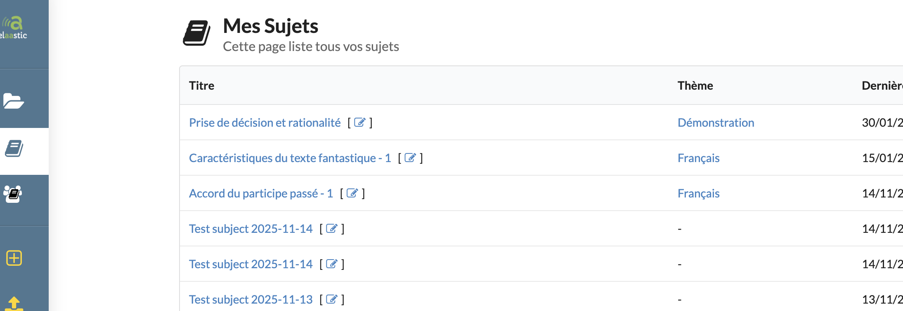

# subject-001 : Find all subjects owned by the current user relative to a given topic

## Description
As a client of the user api \
I want to **get** a representation of all subjects owned by the current user for a given topic \
So that the view can display subjects information relative to one topic

## Acceptance tests

- [ ] All code relative to subject is in the package `org.elaastix.server.material.instructional`.
- [ ] The fetched representation of the collection contains for each subject:
    - its id
    - its title
    - its description
    - the number of questions attached to this subject
    - the last updated date
    - embedded information relative to the parent topic if any (id, title)
- [ ] The collection id ordered by last updated date and title

## Use case in current Elaastic
The display of the collection of all subjects of the current user.\

