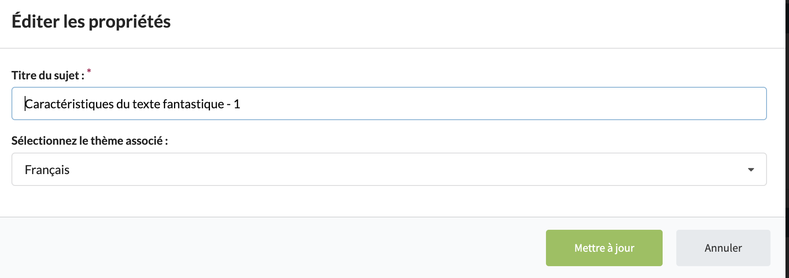

# subject-003 : Edit an existent subject owned by the current user

## Description
As a client of the user api \
I want to **patch** a subject owned by the current user \
So that the view allows the current user to update an existent subject.

## Acceptance tests

- [ ] All code relative to subject is in the package `org.elaastix.server.material.instructional`.
- [ ] The request specifies a maximum of three fields that can be updated by the user with their new value:
    - its title, if it needs to be updated
    - its description, if it needs to be updated
    - its subject id, if it needs to be updated
- [ ] The update of the last updated date is managed on the back-end.
- [ ] The operation fails in case of violation of at least one business rule.

## Use case in current Elaastic
The ability for the current user to edit an existent subject.\

> [!NOTE]
> In current Elaastic, the description is not editable.

