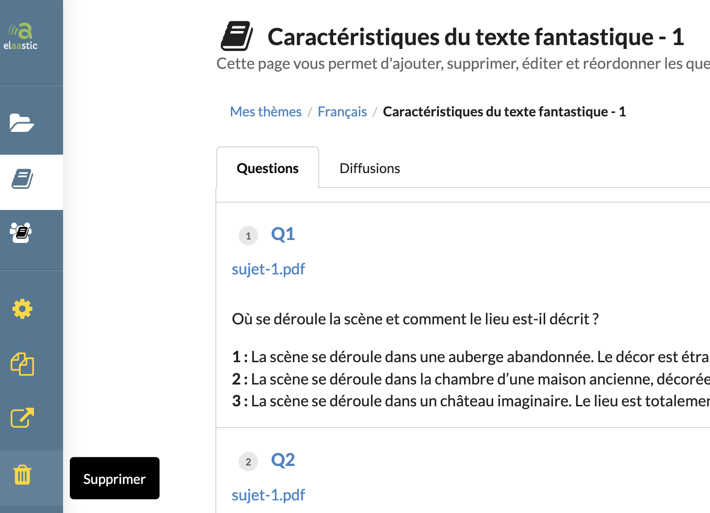

# topic-004 : Delete an existent topic owned by the current user

## Description
As a client of the user api \
I want to **delete** an existent subject owned by the current user \
So that the view allows the current user to delete an existent subject.

## Acceptance tests

- [ ] All code relative to topic is in the package `org.elaastix.server.material.instructional`.
- [ ] The request specifies the id of the subject to delete
- [ ] The delete operation fails in case of a subject containing at least one subject.

## Use case in current Elaastic
The ability for the current user to delete an existent subject.\

