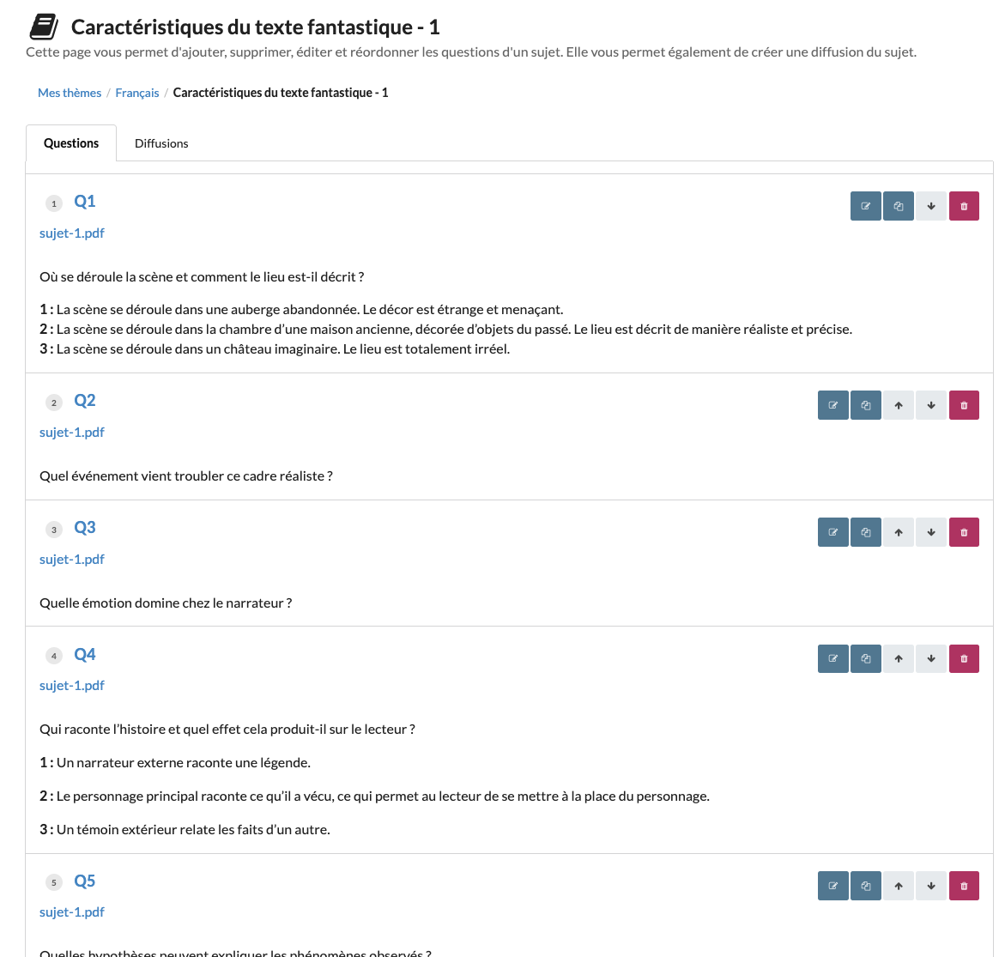

# subject-005 : Find a subject of the current user with its list of items

## Description
As a client of the user api \
I want to **get** a representation of the subject owned by the current user with a given Id \
So that the view can display the subject and its items information

## Acceptance tests

- [ ] All code relative to subject is in the package `org.elaastix.server.material.instructional`.
- [ ] The fetched representation contains the following information on the subject:
  - its id
  - its title
  - its description
  - the last updated date
  - the embedded information on its topic if any
- [ ] the collection of items contains for each item:
    - its id
    - its title
    - its statement
    - the embedded information on its attachment if any (id and name)
    - the last updated date
    - its type (simple statement, Open ended question (Question), MCQ or UCQ)
- [ ] The collection of items is ordered by rank and title

## Use case in current Elaastic
The display of the list of items for a given subject.\

