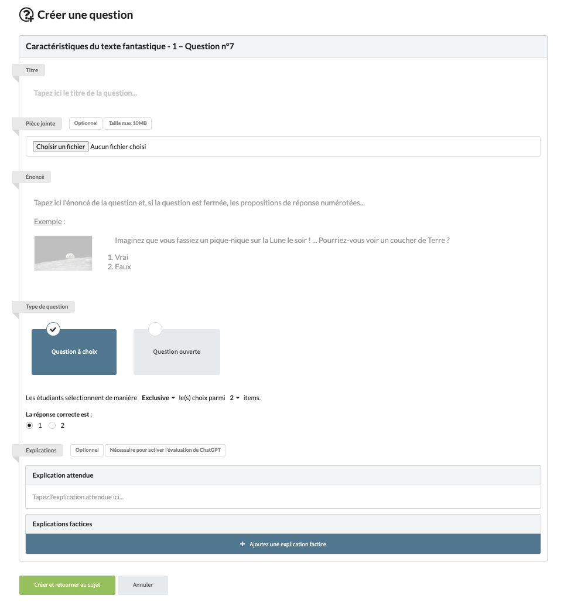

# subjectItem-002 : Create a new subject item owned by the current user

## Description
As a client of the user api \
I want to **post** a new subject item owned by the current user \
So that the view allows the current user to post a new subject item

## Acceptance tests

- [ ] All code relative to subject is in the package `org.elaastix.server.material.instructional`.
- [ ] The new subject item is characterized by :
    - its title
    - its statement
    - its subject id
    - the embedded attachment information if any:
      - the attachment name
      - other useful metadata on the attachment (see Spring boot API)
      - the attachment content
    - its rank
    - its type (simple statement, Open ended question (Question), MCQ or UCQ)
    - the expected explanation if any (only for compliant types)
    - the list of choices (only for compliant MCQ and UCQ types)
    - the list of expected choices (only for MCQ)
    - the expected choice (only for UCQ)
- [ ] The update of all other fields are managed on the back-end (owner, creation date, subject, etc.)
- [ ] The operation fails in case of violation of at least one business rule.

## Use case in current Elaastic
The ability for the current user to create a new subject item.\

> [!NOTE]
> In current Elaastic, the description is not editable.
