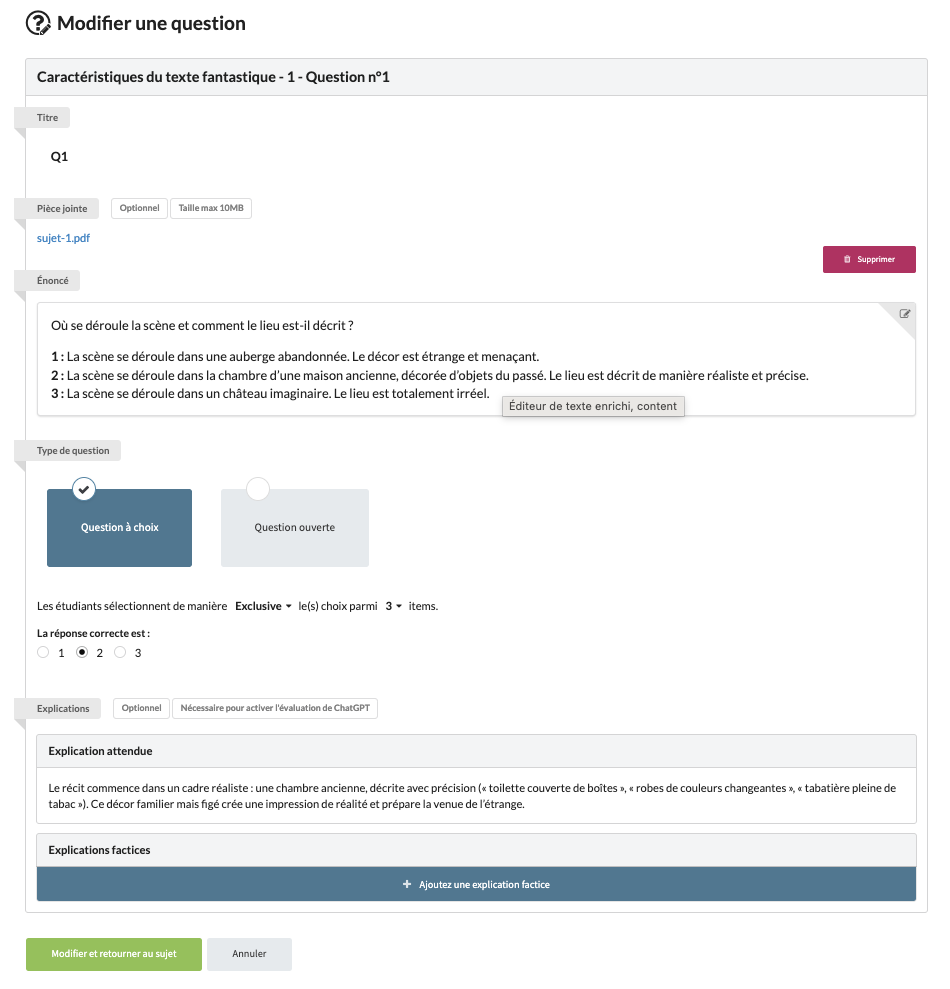

# subjectItem-003 : Edit an existent subject item owned by the current user

## Description
As a client of the user api \
I want to **patch** a subject item owned by the current user \
So that the view allows the current user to update an existent subject item.

## Acceptance tests

- [ ] All code relative to subject is in the package `org.elaastix.server.material.instructional`.
- [ ] The request specifies the fields to update with their new value:
    - its title
    - its statement
    - its attachment id
    - its rank
    - its type (simple statement, Open ended question (Question), MCQ or UCQ)
    - the expected explanation if any (only for compliant types)
    - the list of choices (only for compliant MCQ and UCQ types)
    - the list of expected choices (only for MCQ)
    - the expected choice (only for UCQ)
- [ ] The update of the last updated date is managed on the back-end.
- [ ] The operation fails in case of violation of at least one business rule.

## Use case in current Elaastic
The ability for the current user to edit an existent subject item.\

> [!NOTE]
> In current Elaastic, the list of labels of each choice is not editable. These labels are embedded in the statement.

