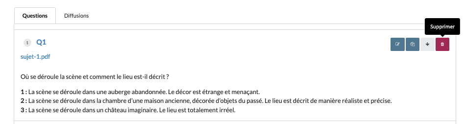

# subjectItem-004 : Delete an existent subject item owned by the current user

## Description
As a client of the user api \
I want to **delete** an existent subject item owned by the current user \
So that the view allows the current user to delete an existent subject item.

## Acceptance tests

- [ ] All code relative to subject item is in the package `org.elaastix.server.material.instructional`.
- [ ] The request specifies the id of the item to delete
- [ ] The attachment, if any is deleted by cascade

## Use case in current Elaastic
The ability for the current user to delete an existent item.\

