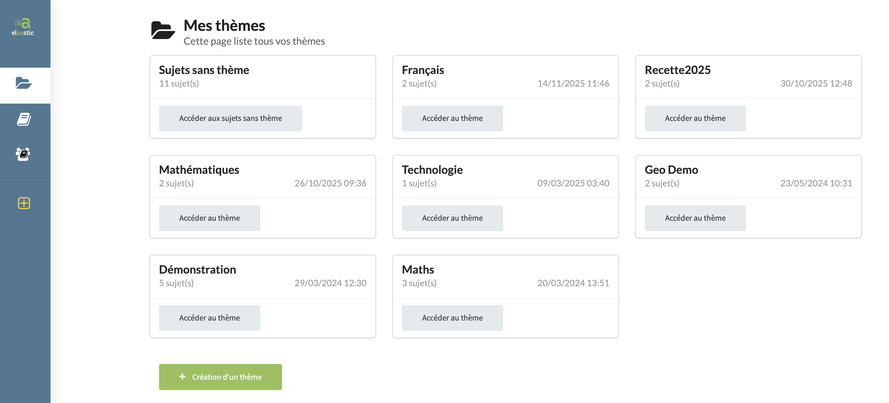

# topic-001 : Find all topics owned by the current user

## Description
As a client of the user api \
I want to **get** a representation of all topics owned by the current user \
So that the view can display topics information

## Acceptance tests

- [ ] All code relative to topic is in the package `org.elaastix.server.material.instructional`.
- [ ] The fetched representation of the collection contains for each topic:
    - its id
    - its title
    - its description
    - the number of subjects attached to this topic
    - the last updated date
- [ ] The collection is ordered by last updated date and title

## Use case in current Elaastic
The display of the collection of all topics in the home page of a teacher after authentication.\

