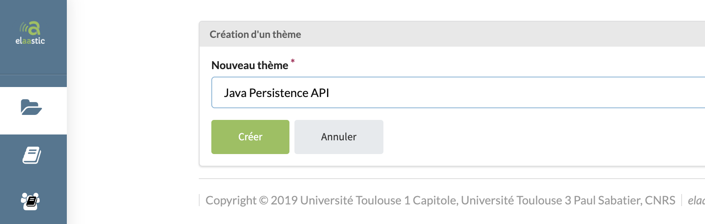

# topic-002 : Create a new topic owned by the current user

## Description
As a client of the user api \
I want to **post** a new topic owned by the current user \
So that the view allows the current user to post a new topic

## Acceptance tests

- [ ] All code relative to topic is in the package `org.elaastix.server.material.instructional`.
- [ ] The new topic is characterized by :
    - its title
    - its description
- [ ] The update of all other fields are managed on the back-end (owner, creation date, etc.)
- [ ] The operation fails in case of violation of at least one business rule.

## Use case in current Elaastic
The ability for the current user to create a new topic.\

> [!NOTE]
> In current Elaastic, the description is not editable.
