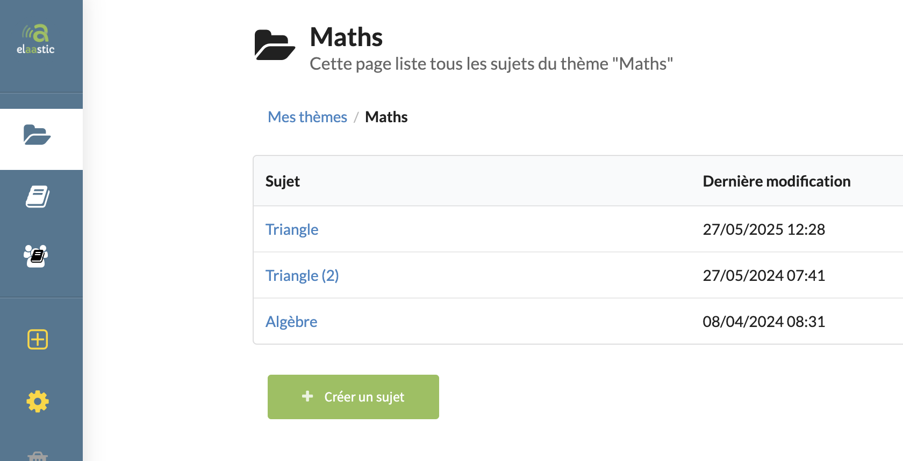

# topic-005 : Find a topic of the current user with its list of subjects

## Description
As a client of the user api \
I want to **get** a representation of the topic owned by the current user with a given Id \
So that the view can display the topic and its subjects information

## Acceptance tests

- [ ] All code relative to topic is in the package `org.elaastix.server.material.instructional`.
- [ ] The fetched representation contains the following information on the topic:
  - its id
  - its title
  - its description
  - the last updated date
- [ ] the collection of subjects contains for each subject:
    - its id
    - its title
    - its description
    - the number of questions attached to this subject
    - the last updated date
- [ ] The collection of subjects is ordered by last updated date and title

## Use case in current Elaastic
The display of the list of subjects for a given topic.\

