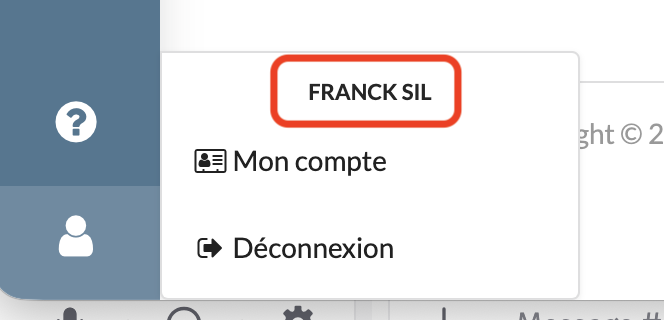

# user api spec

## User.001 : Find user by Id

### Description
As a client of the user api \
I want to **get** a representation of a user given its Id \
So that the view can display user information

### Acceptance tests

- [ ] All code relative to user is in the package `org.elaastix.server.user`.
- [ ] The fetched representation of the user contains the id and the display name.

### Use case in current Elaastic
The display of the display name on demand on all pages.\

### User Resource

The User resource corresponds to the User entity described in the UML schema `specs/user/uml/user.puml`.\

